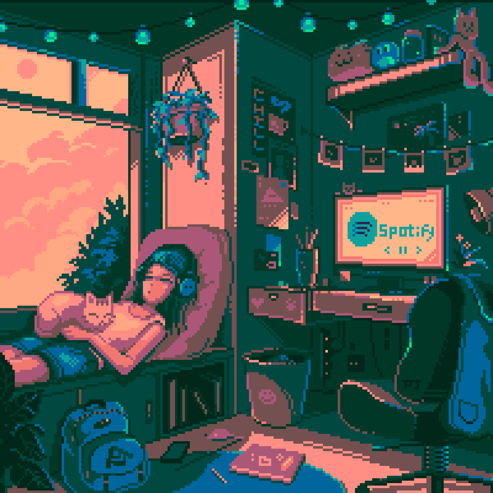

<!-- Masterhead Animation -->

  

<h1 align="center">
  
</h1>

---

## 💫 About Me

- 🔭 I’m currently working on Data Science and Machine Learning
- 👯 I’m looking to collaborate on Machine Learning Projects
- 🤝 I’m looking for help with image processing and Machine Learning
- 🌱 I’m currently learning Data Science, Machine Learning and Image Processing
- 💬 Ask me about anything!
- ⚡ Fun fact: I like to learn Japanese in my free time.

---

## 🌐 Socials

  
  
  
  

---

## 💻 Tech Stack

  
  
  
  
  
  
  
  
  
  
  
  
  
  
  
  
  
  
  

---

## 📊 GitHub Stats

   
   
  

---

## 🏆 GitHub Trophies

  

---

## 🚀 Leetcode Info

<h2 align="center">Leetcode Info</h2>

  

  

---

## 📫 How to Reach Me

- 📬 **Email:** pratiharkirti@gmail.com

---

## 🕒 Visitor Count

  

<!-- Proudly created with GPRM ( https://gprm.itsvg.in ) --> 
